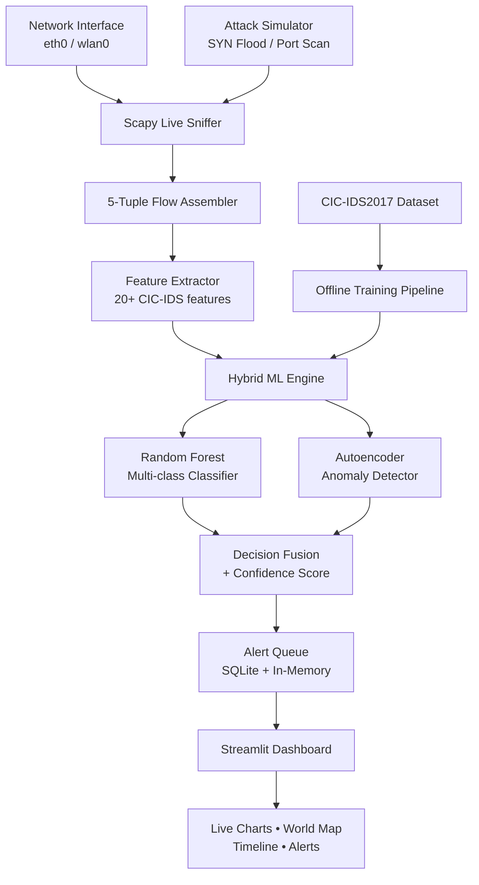

# 🛡️ AI-NIDS — AI-Driven Network Intrusion Detection System

> **⚠️ EDUCATIONAL USE ONLY — Run exclusively in isolated lab environments (VirtualBox NAT / Docker). Never scan real networks or public IPs.**

---

## 1. Project Overview

Build a **real-time, hybrid IDS/NIDS** that:

1. Captures live network packets via **Scapy**
2. Extracts **20+ CIC-IDS2017-style flow features**
3. Classifies traffic with a **Random Forest** (14 attack types + Benign)
4. Detects zero-day threats with an **Autoencoder** anomaly scorer
5. Fuses both models into a **single confidence-scored alert**
6. Streams everything to a **live Streamlit dashboard** (charts, maps, alerts)
7. Includes a **one-click attack simulator** for demos

---

## 2. Architecture



---

## 3. Tech Stack

| Layer | Technology | Why |
|-------|-----------|-----|
| Language | Python 3.11+ | Industry standard for ML + networking |
| Packet Capture | Scapy | Lightweight, scriptable, Docker-friendly |
| Data Processing | Pandas, NumPy | Fast feature engineering |
| ML — Supervised | Scikit-learn (Random Forest) | Multi-class attack classification |
| ML — Unsupervised | TensorFlow / Keras (Autoencoder) | Zero-day anomaly detection |
| Dashboard | Streamlit | Fastest path to live-updating UI |
| Visualization | Plotly, Folium | Interactive charts + geo map |
| Storage | SQLite | Zero-config, file-based |
| Deployment | Docker Compose | One-command start |
| Testing | pytest, Scapy | Unit + integration + live simulation |

---

## 4. Datasets

### Primary — CIC-IDS2017

- **Official source:** <https://www.unb.ca/cic/datasets/ids-2017.html> → download `MachineLearningCSV.zip`
- **Cleaned version (recommended start):** <https://www.kaggle.com/datasets/ericanacletoribeiro/cicids2017-cleaned-and-preprocessed> → `cicids2017_cleaned.csv`

### Secondary — NSL-KDD (smaller, good for unit tests)

Place all CSV files in `data/cic_ids2017/`.

---

## 5. Folder Structure

```
AI-NIDS-Project/
├── docker-compose.yml          # One-command deploy
├── Dockerfile                  # Python 3.11 + all deps
├── requirements.txt            # Pinned dependencies
├── README.md                   # Setup + demo instructions
├── AGENTS.md                   # Coding-style rules for AI agents
│
├── data/
│   └── cic_ids2017/            # CSV files go here (gitignored)
│
├── src/
│   ├── __init__.py
│   ├── capture/
│   │   ├── __init__.py
│   │   └── sniffer.py          # Live Scapy packet sniffer
│   ├── features/
│   │   ├── __init__.py
│   │   └── extractor.py        # Flow → 20+ feature DataFrame row
│   ├── models/
│   │   ├── __init__.py
│   │   ├── train_rf.py         # RF training + GridSearchCV
│   │   ├── autoencoder.py      # Keras AE train + predict
│   │   └── hybrid_predictor.py # Load both → fused alert
│   ├── backend/
│   │   ├── __init__.py
│   │   └── alert_manager.py    # Alert queue, SQLite logging, IP block flags
│   ├── dashboard/
│   │   ├── __init__.py
│   │   └── app.py              # Streamlit dashboard
│   ├── simulator/
│   │   ├── __init__.py
│   │   └── attack_sim.py       # SYN flood, port scan generators
│   └── utils/
│       ├── __init__.py
│       └── geoip.py            # IP → lat/lon for Folium map
│
├── notebooks/
│   └── exploration.ipynb       # EDA & model experiments
│
├── models/                     # Saved model artifacts (gitignored)
│   ├── rf_model.pkl
│   ├── autoencoder.h5
│   └── scaler.pkl
│
├── logs/                       # Runtime logs (gitignored)
│
└── tests/
    ├── test_sniffer.py
    ├── test_extractor.py
    ├── test_models.py
    ├── test_alert_manager.py
    └── test_simulator.py
```

---

## 6. Implementation Plan — Module by Module

> **Coding standard for every file:** secure, commented, production-ready Python with full error handling, type hints, logging (`logging` module), and docstrings.

---

### Phase 1 · Offline Training (Week 1)

#### 6.1 Data Loading & Preprocessing (`src/features/extractor.py`)

| Item | Detail |
|------|--------|
| **Input** | Raw CIC-IDS2017 CSV(s) from `data/cic_ids2017/` |
| **Steps** | 1. Load with Pandas, strip whitespace from column names<br>2. Drop `Inf` / `NaN` rows<br>3. Encode labels → integer mapping (15 classes)<br>4. Standard-scale numerical features → save `scaler.pkl`<br>5. Train/test split (80/20, stratified) |
| **Output** | `X_train`, `X_test`, `y_train`, `y_test` NumPy arrays |
| **Target features (minimum 20)** | Flow Duration, Total Fwd Packets, Total Bwd Packets, Fwd Packet Length (max/min/mean/std), Bwd Packet Length (max/min/mean/std), Flow Bytes/s, Flow Packets/s, Flow IAT (mean/std/max/min), Fwd IAT Total, Bwd IAT Total, Fwd PSH Flags, SYN Flag Count, RST Flag Count, ACK Flag Count, Average Packet Size, Fwd Header Length, Subflow Fwd Bytes |

#### 6.2 Random Forest Classifier (`src/models/train_rf.py`)

```
Inputs:  X_train, y_train (from extractor)
Process:
  1. GridSearchCV over {n_estimators: [100,200,300], max_depth: [20,30,None], min_samples_split: [2,5]}
  2. 5-fold stratified CV
  3. Train final model on full train set
  4. Print classification_report on test set (target accuracy ≥ 92%)
  5. Save to models/rf_model.pkl via joblib
Outputs: rf_model.pkl, printed classification report, feature importance plot
```

#### 6.3 Autoencoder Anomaly Detector (`src/models/autoencoder.py`)

```
Inputs:  X_train filtered to ONLY Benign rows
Architecture:
  Input(20) → Dense(14, relu) → Dense(8, relu) → Dense(5, relu)   [encoder]
           → Dense(8, relu) → Dense(14, relu) → Dense(20, sigmoid) [decoder]
Training:
  - optimizer: Adam(lr=1e-3)
  - loss: MSE
  - epochs: 50, batch_size: 256, validation_split=0.1
  - EarlyStopping(patience=5)
Threshold:
  - Compute reconstruction error on benign validation set
  - threshold = mean + 3 * std  (configurable)
Save: models/autoencoder.h5
Predict function:
  - Input: single feature row (scaled)
  - Output: {"anomaly_score": float, "is_anomaly": bool}
```

#### 6.4 Hybrid Predictor (`src/models/hybrid_predictor.py`)

```python
class HybridPredictor:
    def __init__(self, rf_path, ae_path, scaler_path, threshold):
        # Load all models + scaler

    def predict(self, features: dict) -> dict:
        """
        Returns:
          {
            "rf_label": str,          # e.g. "DDoS"
            "rf_confidence": float,   # 0.0–1.0
            "ae_anomaly_score": float,
            "ae_is_anomaly": bool,
            "final_verdict": str,     # "Benign" | "Attack" | "Suspicious"
            "combined_confidence": float,
            "timestamp": str
          }
        Decision logic:
          - If RF says attack AND AE says anomaly → "Attack" (high confidence)
          - If RF says attack XOR AE says anomaly → "Suspicious" (medium confidence)
          - If both say benign → "Benign"
        """
```

---

### Phase 2 · Real-Time Capture (Week 2)

#### 6.5 Packet Sniffer (`src/capture/sniffer.py`)

```
Responsibilities:
  1. Sniff on configurable interface (default: eth0, env var SNIFF_IFACE)
  2. Group packets into flows by 5-tuple: (src_ip, dst_ip, src_port, dst_port, protocol)
  3. Flow timeout: 60 seconds (configurable via FLOW_TIMEOUT env var)
  4. Thread-safe: use threading.Lock for flow dict
  5. Yields completed flows as Python dicts to a callback or queue
  6. Graceful shutdown via signal handler (SIGINT/SIGTERM)

Flow dict schema:
  {
    "src_ip": str,
    "dst_ip": str,
    "src_port": int,
    "dst_port": int,
    "protocol": int,
    "packets": [{"timestamp": float, "size": int, "flags": int, "direction": "fwd"|"bwd"}, ...],
    "start_time": float,
    "end_time": float
  }
```

#### 6.6 Live Feature Extractor (extend `src/features/extractor.py`)

```
New function: extract_live_features(flow_dict) -> pd.DataFrame (single row)
  - Computes the same 20+ features from raw packet list
  - Applies the saved scaler (scaler.pkl)
  - Returns DataFrame compatible with HybridPredictor.predict()
```

---

### Phase 3 · Backend & Alerting (Week 3)

#### 6.7 Alert Manager (`src/backend/alert_manager.py`)

```
Responsibilities:
  1. Receive predictions from HybridPredictor
  2. Store all alerts in SQLite (alerts.db) with schema:
     | id | timestamp | src_ip | dst_ip | src_port | dst_port | protocol |
     | rf_label | rf_confidence | ae_score | final_verdict | combined_confidence |
  3. Maintain in-memory deque (last 500 alerts) for dashboard speed
  4. "Block IP" flag: write to blocked_ips table (simulated response)
  5. Export logs to CSV on demand
  6. Expose methods:
     - get_recent_alerts(n=100) -> list[dict]
     - get_top_attackers(n=10) -> list[dict]
     - get_attack_distribution() -> dict
     - block_ip(ip: str) -> bool
     - export_csv(path: str) -> str
```

---

### Phase 4 · Dashboard & Simulation (Week 4)

#### 6.8 Streamlit Dashboard (`src/dashboard/app.py`)

```
Layout (top to bottom):
  ┌─────────────────────────────────────────────────┐
  │  🛡️ AI-NIDS — Live Network Monitor              │
  │  [Status: ● Online]  [Packets: 12,483]          │
  ├────────────────────┬────────────────────────────┤
  │  Attack Pie Chart  │  Alert Timeline (last 1h)   │
  │  (Plotly donut)    │  (Plotly scatter/line)       │
  ├────────────────────┴────────────────────────────┤
  │  🗺️ World Map — Source IPs (Folium)              │
  ├────────────────────┬────────────────────────────┤
  │  Top 10 Attackers  │  Recent Alerts Table         │
  │  (Plotly bar)      │  (st.dataframe, color-coded) │
  ├────────────────────┴────────────────────────────┤
  │  ⚡ Attack Simulator                             │
  │  [SYN Flood ▶]  [Port Scan ▶]  [Slowloris ▶]   │
  ├─────────────────────────────────────────────────┤
  │  🚫 Block IP   [________]  [Block]  [Export CSV] │
  └─────────────────────────────────────────────────┘

Refresh: st.session_state polling every 5 seconds
Color scheme: dark theme with red/amber/green severity coding
```

#### 6.9 Attack Simulator (`src/simulator/attack_sim.py`)

```
Functions (all use Scapy, target configurable IP):
  1. syn_flood(target_ip, target_port=80, count=1000)
     - Randomized source IPs, SYN flag set
  2. port_scan(target_ip, port_range=(1, 1024))
     - SYN scan across port range
  3. slowloris(target_ip, target_port=80, num_connections=50)
     - Open connections, send partial headers

Each function:
  - Runs in a background thread
  - Logs to logging module
  - Returns {"status": "started", "attack_type": str, "target": str}
```

#### 6.10 GeoIP Utility (`src/utils/geoip.py`)

```
- Use free MaxMind GeoLite2 database or ip-api.com (free tier)
- Function: get_location(ip: str) -> {"lat": float, "lon": float, "country": str, "city": str}
- Cache results in-memory (dict) to avoid repeated lookups
- Handle private IPs gracefully (return None / default coords)
```

---

## 7. Docker Setup

### `Dockerfile`

```dockerfile
FROM python:3.11-slim
RUN apt-get update && apt-get install -y libpcap-dev && rm -rf /var/lib/apt/lists/*
WORKDIR /app
COPY requirements.txt .
RUN pip install --no-cache-dir -r requirements.txt
COPY . .
EXPOSE 8501
CMD ["streamlit", "run", "src/dashboard/app.py", "--server.port=8501", "--server.address=0.0.0.0"]
```

### `docker-compose.yml`

```yaml
version: "3.9"
services:
  nids:
    build: .
    container_name: ai-nids
    network_mode: host          # required for packet capture
    cap_add:
      - NET_ADMIN
      - NET_RAW
    volumes:
      - ./data:/app/data
      - ./models:/app/models
      - ./logs:/app/logs
    environment:
      - SNIFF_IFACE=eth0
      - FLOW_TIMEOUT=60
      - PYTHONUNBUFFERED=1
    ports:
      - "8501:8501"
    healthcheck:
      test: ["CMD", "curl", "-f", "http://localhost:8501/_stcore/health"]
      interval: 30s
      timeout: 10s
      retries: 3
    restart: unless-stopped
```

### `requirements.txt`

```
scapy>=2.5.0
pandas>=2.1.0
numpy>=1.26.0
scikit-learn>=1.3.0
tensorflow>=2.15.0
streamlit>=1.30.0
plotly>=5.18.0
folium>=0.15.0
streamlit-folium>=0.15.0
joblib>=1.3.0
requests>=2.31.0
pytest>=7.4.0
```

---

## 8. Coding Standards (`AGENTS.md`)

All AI-generated code **must** follow these rules:

1. **Type hints** on every function signature
2. **Docstrings** (Google-style) on every class and public method
3. **`logging`** module — no `print()` in production code
4. **Error handling** — try/except with specific exceptions, never bare `except:`
5. **Constants** in UPPER_SNAKE_CASE at module top
6. **Environment variables** for all configurable values (interface, timeouts, paths)
7. **Thread safety** — use `threading.Lock` wherever shared state exists
8. **Unit tests** — pytest, one test file per source module, minimum 3 tests per module
9. **Security** — validate all user inputs, no `eval()`, no hardcoded credentials
10. **Line length** ≤ 120 characters
11. **Imports** — stdlib first, third-party second, local third, separated by blank lines

---

## 9. Testing Plan

### Unit Tests (`tests/`)

| Test File | What It Covers |
|-----------|---------------|
| `test_extractor.py` | Feature computation correctness; NaN/Inf handling; scaler consistency |
| `test_models.py` | RF predict shape; AE anomaly score range; hybrid fusion logic |
| `test_sniffer.py` | Flow assembly from mock packets; timeout behavior; thread safety |
| `test_alert_manager.py` | SQLite write/read; top attackers query; CSV export |
| `test_simulator.py` | Packet generation correctness (SYN flag set, etc.) |

### Integration Tests

1. **End-to-end pipeline:** mock packets → sniffer → extractor → predictor → alert → verify in DB
2. **Dashboard smoke test:** launch Streamlit, verify 200 on `/_stcore/health`

### Live Demo Test

1. Start system in Docker
2. From a separate terminal (or Kali VM), run:
   - `hping3 --flood -S <target_ip>` (SYN flood)
   - `nmap -sS -T4 <target_ip>` (port scan)
3. **Expected:** alerts appear in dashboard within 30 seconds with correct labels and ≥ 85% confidence

---

## 10. Week-by-Week Schedule

### Week 1 — Offline Training (Models Ready)

| Day | Task | Owner | Deliverable |
|-----|------|-------|-------------|
| 1-2 | Download CIC-IDS2017, EDA in notebook | Member 2 | `notebooks/exploration.ipynb` |
| 1-2 | Docker setup, folder scaffold | Member 1 | `Dockerfile`, `docker-compose.yml` |
| 3-4 | Feature extractor (offline mode) | Member 2 | `src/features/extractor.py` |
| 3-5 | Train Random Forest + GridSearchCV | Member 3 | `src/models/train_rf.py`, `models/rf_model.pkl` |
| 4-6 | Train Autoencoder on benign data | Member 3 | `src/models/autoencoder.py`, `models/autoencoder.h5` |
| 5-7 | Hybrid predictor + unit tests | Member 3 | `src/models/hybrid_predictor.py` |
| 6-7 | Initial test suite | Member 6 | `tests/test_extractor.py`, `tests/test_models.py` |

### Week 2 — Real-Time Capture + Feature Extraction

| Day | Task | Owner | Deliverable |
|-----|------|-------|-------------|
| 8-10 | Live Scapy sniffer with flow assembly | Member 1 | `src/capture/sniffer.py` |
| 8-10 | Live feature extraction function | Member 2 | `extractor.py` updated |
| 9-11 | Alert manager + SQLite schema | Member 4 | `src/backend/alert_manager.py` |
| 10-12 | GeoIP utility | Member 5 | `src/utils/geoip.py` |
| 12-14 | Sniffer + extractor integration test | Member 6 | `tests/test_sniffer.py` |

### Week 3 — Hybrid ML + Alerting Integration

| Day | Task | Owner | Deliverable |
|-----|------|-------|-------------|
| 15-17 | Wire sniffer → extractor → predictor → alerts pipeline | Member 1 + 4 | End-to-end pipeline |
| 15-17 | Attack simulator (SYN flood, port scan) | Member 6 | `src/simulator/attack_sim.py` |
| 16-18 | Dashboard wireframe + live counters | Member 5 | `src/dashboard/app.py` (v1) |
| 18-19 | Integration tests | Member 6 | Full pipeline test |
| 19-21 | Alert manager tests + block-IP feature | Member 4 | `tests/test_alert_manager.py` |

### Week 4 — Dashboard Polish + Testing + Demo

| Day | Task | Owner | Deliverable |
|-----|------|-------|-------------|
| 22-24 | Full dashboard (charts, map, simulator buttons) | Member 5 | `app.py` (final) |
| 22-24 | CSV export + log viewer | Member 4 | Export feature |
| 24-26 | End-to-end testing + live attack demo | Member 6 + 1 | Test report |
| 26-27 | README polish, AGENTS.md, demo video | Member 6 | Final docs |
| 27-28 | Bug fixes, code review, final commit | All | Clean repo |

---

## 11. AI Agent Prompts (Copy-Paste Ready)

> Prefix every prompt with: *"Write secure, commented, production-ready Python code with error handling, type hints, unit tests, and logging."*

### Prompt 1 — Docker & Scaffold

```
Write a complete docker-compose.yml and Dockerfile for a Python 3.11 project
that uses Scapy, Scikit-learn, TensorFlow, Streamlit, Plotly, and Folium.
Include:
- network_mode: host + NET_ADMIN/NET_RAW capabilities
- volumes for data/, models/, logs/
- healthcheck hitting Streamlit's health endpoint
- requirements.txt with pinned minimum versions
Also create the full folder structure with empty __init__.py files.
```

### Prompt 2 — Packet Sniffer

```
Write src/capture/sniffer.py using Scapy to sniff live packets on a
configurable interface (env var SNIFF_IFACE, default eth0). Group packets
into flows by 5-tuple (src_ip, dst_ip, src_port, dst_port, protocol).
Use a 60-second flow timeout (env var FLOW_TIMEOUT). Requirements:
- Thread-safe flow dictionary with threading.Lock
- Background thread for sniffing
- Callback function when a flow completes
- Graceful shutdown via signal handler
- Full logging, type hints, docstrings
```

### Prompt 3 — Feature Extractor

```
Create src/features/extractor.py with two modes:
1. Offline: load CIC-IDS2017 CSV, clean, scale, split → train/test arrays
2. Live: take a flow dict from sniffer.py → single DataFrame row with
   exactly these 20 features: Flow Duration, Total Fwd Packets,
   Total Bwd Packets, Fwd Packet Length Max/Min/Mean/Std,
   Bwd Packet Length Max/Min/Mean/Std, Flow Bytes/s, Flow Packets/s,
   Flow IAT Mean/Std/Max/Min, Fwd IAT Total, Bwd IAT Total,
   SYN Flag Count, Average Packet Size.
Save/load StandardScaler as scaler.pkl. Include unit tests.
```

### Prompt 4 — Random Forest Training

```
Write src/models/train_rf.py that:
1. Loads preprocessed CIC-IDS2017 data from extractor
2. Runs GridSearchCV with n_estimators=[100,200,300],
   max_depth=[20,30,None], 5-fold stratified CV
3. Trains final model on best params
4. Prints sklearn classification_report (target ≥ 92% accuracy)
5. Saves model to models/rf_model.pkl via joblib
6. Plots and saves feature importance as PNG
```

### Prompt 5 — Autoencoder

```
Write src/models/autoencoder.py using Keras:
- Train ONLY on benign traffic rows
- Architecture: 20→14→8→5→8→14→20 (relu, output sigmoid)
- Adam optimizer, MSE loss, 50 epochs, batch 256, EarlyStopping(5)
- Calculate threshold = mean(reconstruction_error) + 3*std
- Save model to models/autoencoder.h5
- Provide predict() function returning {anomaly_score, is_anomaly}
```

### Prompt 6 — Hybrid Predictor

```
Create src/models/hybrid_predictor.py with class HybridPredictor:
- __init__: load RF, AE, scaler from file paths
- predict(features_dict) → returns rf_label, rf_confidence,
  ae_anomaly_score, ae_is_anomaly, final_verdict, combined_confidence
- Decision fusion:
  - Both flag → "Attack" (high confidence)
  - One flags → "Suspicious" (medium)
  - Neither → "Benign"
Include full type hints, logging, and error handling.
```

### Prompt 7 — Alert Manager

```
Write src/backend/alert_manager.py:
- SQLite storage (alerts.db) with full alert schema
- In-memory deque (last 500) for dashboard reads
- Methods: get_recent_alerts(n), get_top_attackers(n),
  get_attack_distribution(), block_ip(ip), export_csv(path)
- Thread-safe DB writes
- Include unit tests with in-memory SQLite
```

### Prompt 8 — Streamlit Dashboard

```
Build src/dashboard/app.py with Streamlit:
- Dark theme, red/amber/green severity colors
- Top bar: status indicator, live packet count
- Row 1: Plotly donut chart (attack distribution) + alert timeline
- Row 2: Folium world map of source IPs
- Row 3: Top 10 attackers bar chart + recent alerts color-coded table
- Row 4: Attack simulator buttons (SYN Flood, Port Scan, Slowloris)
- Row 5: Block IP input + Export CSV button
- Auto-refresh every 5 seconds via st.session_state
```

### Prompt 9 — Attack Simulator

```
Write src/simulator/attack_sim.py with Scapy:
- syn_flood(target_ip, port=80, count=1000): random src IPs, SYN flag
- port_scan(target_ip, ports=(1,1024)): SYN scan
- slowloris(target_ip, port=80, connections=50): partial headers
Each runs in a background thread, logs to logging module,
returns status dict. Include safety checks and warnings.
```

### Prompt 10 — GeoIP Utility

```
Write src/utils/geoip.py:
- get_location(ip) → {lat, lon, country, city}
- Use ip-api.com free tier (or MaxMind GeoLite2 if available)
- Cache results in memory dict
- Handle private IPs (10.x, 172.16-31.x, 192.168.x) → return None
- Rate-limit external API calls to 45/minute
```

---

## 12. Final Deliverables Checklist

- [ ] Fully working Docker app (`docker compose up --build` → dashboard live)
- [ ] Clean GitHub repo with comprehensive `README.md`
- [ ] `AGENTS.md` with coding style rules
- [ ] Trained models (`rf_model.pkl`, `autoencoder.h5`, `scaler.pkl`) in `models/`
- [ ] All unit tests passing (`pytest tests/ -v`)
- [ ] Accuracy report ≥ 92% on CIC-IDS2017 test set
- [ ] 2-minute demo video showing live attack → instant detection
- [ ] CSV/log export working
- [ ] Attack simulator functional from dashboard

---

## 13. Safety & Ethics Reminder

> [!CAUTION]
> - **NEVER** run this system on production networks or public infrastructure
> - **ALWAYS** use isolated environments: VirtualBox NAT, Docker internal network, or dedicated lab VLAN
> - **NEVER** scan real IPs or networks you don't own
> - Include clear `⚠️ Educational use only` warnings in README, code headers, and dashboard UI
> - All attack simulation features must be opt-in and clearly labeled

---

## 14. Nice-to-Have Extensions

If the core system is complete ahead of schedule:

1. **LIME / SHAP Explainability** — "Why was this flow flagged?" feature importance per prediction
2. **Slack / Telegram Alerts** — Send critical alerts to a chat channel
3. **Zeek Integration** — Replace Scapy with Zeek for richer flow logs
4. **Raspberry Pi Deployment** — Physical "home IDS box"
5. **MITRE ATT&CK Mapping** — Map detected attacks to MITRE technique IDs
6. **Elasticsearch + Kibana** — Replace SQLite for production-scale log analysis
